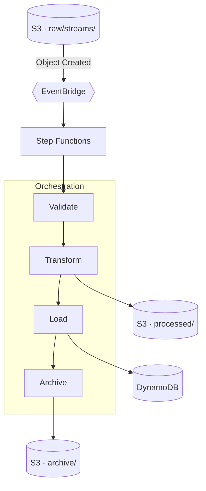

# Music Streaming ETL Pipeline

I built a serverless data pipeline on AWS that transforms raw music-streaming files into daily, genre-level listening metrics served from DynamoDB. Files arrive in S3 at unpredictable times, and each one triggers the pipeline automatically. The infrastructure is defined entirely in Terraform, with a GitHub Actions workflow for plan and apply.

**Built with:** S3, EventBridge, Step Functions, AWS Glue (PySpark + Python Shell), Lambda, DynamoDB, SNS, and CloudWatch.

---

## Architecture

An S3 `Object Created` event on `raw/streams/` starts the pipeline the moment a file lands, so there's no polling or fixed batch window.



A Step Functions state machine runs the steps in order, retrying a step if it fails.

| # | Step | Runs on | Purpose |
| - | ---- | ------- | ------- |
| 1 | AcquireLock | DynamoDB | Acquires a lock so only one run executes at a time |
| 2 | ValidateInputs | Glue Python Shell | Confirms each file has its required columns; stops early otherwise |
| 3 | TransformKPIs | Glue PySpark | Cleans the data, appends it to the event store, and recomputes the KPIs |
| 4 | LoadDynamoDB | Glue Python Shell | Writes the KPIs to DynamoDB |
| 5 | ArchiveProcessedFiles | Lambda | Moves the processed files to `archive/` |
| 6 | ReleaseLock | DynamoDB | Releases the lock |

The lock is released on both the success and failure paths, so a failed run never leaves it held.

---

## Input data

Required columns per file:

| File | Required columns |
| ---- | ---------------- |
| `songs.csv` | `track_id`, `track_name`, `duration_ms`, `track_genre` |
| `users.csv` | `user_id`, `user_name`, `user_age`, `user_country`, `created_at` |
| `streams.csv` | `user_id`, `track_id`, `listen_time` |

---

## KPIs

Computed daily, per genre:

- **Listen count** — total plays for the genre
- **Unique listeners** — distinct users who played it
- **Total listening time** — summed track duration
- **Average listening time per user** — total time divided by unique listeners
- **Top 3 songs** in the genre
- **Top 5 genres** overall

A single day's data can arrive across several files. To keep the daily figures correct, the transform job maintains a cumulative store of cleaned events and recomputes the metrics from the full store on every run, so a later file adds to the day's totals rather than overwriting them. Events are partitioned by source file, so reprocessing a file replaces only its own slice instead of double-counting.

---

## Data model

The tables are keyed around their read patterns, so every lookup is a single-key read with no table scans.

| Table | Partition key | Sort key | Serves |
| ----- | ------------- | -------- | ------ |
| `genre-daily-kpis` | `date_genre` (e.g. `2024-06-25#romance`) | — | a genre's metrics for a given day |
| `top-songs-per-genre-daily` | `date_genre` | `rank` | the top 3 songs for a genre on a day |
| `top-genres-daily` | `listen_date` | `rank` | the top 5 genres for a day |

---

## Project layout

```
music-streaming-etl-terraform/
├── .github/workflows/terraform.yml   # the CI/CD workflow
├── bootstrap/
├── data/                             # sample CSVs
├── examples/                         # sample start-execution payload
├── glue_scripts/                     # validate / transform / load
├── lambda/                           # archive_files.py
├── tests/                            # unit tests
├── locals.tf                         # names and prefixes, defined once
├── s3.tf  dynamodb.tf  glue.tf  iam.tf  lambda.tf
├── step_functions.tf  triggers.tf  alerting.tf  logging.tf
├── backend.tf  backend.hcl           # S3 remote state
├── variables.tf  outputs.tf  providers.tf  versions.tf
├── pytest.ini  requirements-dev.txt  .tflint.hcl  .checkov.yaml
└── README.md
```

---

## Getting started

Requirements: Terraform 1.5+, the AWS CLI authenticated to `eu-west-1`, an account with permission to create these resources, and Python 3.11 to run the tests.

```bash
cp terraform.tfvars.example terraform.tfvars   # set alert_email to receive failure emails

terraform init
terraform validate
terraform plan
terraform apply
```

Configurable variables (`terraform.tfvars`):

| Variable | Default | Purpose |
| -------- | ------- | ------- |
| `top_n_songs` | `3` | top songs per genre per day |
| `top_n_genres` | `5` | top genres per day |
| `alert_email` | `null` | address for failure alerts |
| `glue_worker_type` | `G.1X` | PySpark worker type |
| `glue_number_of_workers` | `2` | PySpark worker count |
| `upload_sample_data` | `true` | seed `raw/` with the sample CSVs on apply |

---

## Running the pipeline

With `upload_sample_data = true`, the first apply seeds the data and the pipeline runs automatically. To process new data, upload a file:

```bash
aws s3 cp streams4.csv s3://$(terraform output -raw s3_bucket)/raw/streams/
```

A run can also be started manually (useful for backfills or reruns):

```bash
aws stepfunctions start-execution \
  --state-machine-arn $(terraform output -raw state_machine_arn) \
  --input file://examples/start-execution.json
```

---

## Querying results

```bash
# one genre's KPIs for a day
aws dynamodb get-item \
  --table-name music-streaming-etl-genre-daily-kpis \
  --key '{"date_genre":{"S":"2024-06-25#acoustic"}}'

# top 3 songs in a genre that day
aws dynamodb query \
  --table-name music-streaming-etl-top-songs-per-genre-daily \
  --key-condition-expression "date_genre = :dg" \
  --expression-attribute-values '{":dg":{"S":"2024-06-25#acoustic"}}'

# top 5 genres that day
aws dynamodb query \
  --table-name music-streaming-etl-top-genres-daily \
  --key-condition-expression "listen_date = :d" \
  --expression-attribute-values '{":d":{"S":"2024-06-25"}}'
```

---

## Tests

The Python logic is unit-tested, so it can be verified without AWS or Spark:

```bash
pip install -r requirements-dev.txt
pytest -q
```

- `tests/test_validate_inputs.py` — the required-column check
- `tests/test_load_to_dynamodb.py` — float-to-`Decimal` coercion before writing to DynamoDB
- `tests/test_archive_files.py` — the archive move logic (copy-then-delete, skips directory markers)

The PySpark job is not unit-tested (it needs the Glue runtime); it is exercised end to end when the pipeline runs.

---

## CI/CD

Terraform owns the infrastructure and a single [terraform.yml](.github/workflows/terraform.yml) workflow runs it. State is held in S3 with DynamoDB locking, so CI and local runs share the same state.

- On a **pull request**: the checks (`pytest`, `terraform fmt`, `tflint`, Checkov) and a `plan`.
- From the **Run workflow** button: `plan`, `apply`, or `destroy`. Apply and destroy require approval through the `production` environment.

**Credentials.** The workflow authenticates with short-lived keys stored as GitHub secrets (`AWS_ACCESS_KEY_ID`, `AWS_SECRET_ACCESS_KEY`, `AWS_SESSION_TOKEN`), which is what works in the DCE sandbox I built this against. On a persistent account I would use OIDC instead (no stored keys); the `bootstrap/` config already provisions the OIDC provider and CI role, so it only requires switching the auth step to `role-to-assume: ${{ vars.AWS_ROLE_ARN }}`.

Setup is a one-time step. `bootstrap/` creates the state bucket, lock table, OIDC provider, and CI role:

```bash
cd bootstrap && terraform init && terraform apply     # note the outputs
cd .. && terraform init -backend-config=backend.hcl -migrate-state
```

Then, under *Settings → Secrets and variables → Actions*, add the AWS credential secrets (or an `AWS_ROLE_ARN` variable for OIDC) and create a `production` environment with a required reviewer.

---

## Operations

**Concurrency.** A run reprocesses everything in `raw/streams/` and then archives it, so the lock prevents overlapping runs. If a run is force-cancelled and leaves the lock in place, remove it manually:

```bash
aws dynamodb delete-item \
  --table-name music-streaming-etl-pipeline-lock \
  --key '{"LockName":{"S":"pipeline"}}'
```

**Monitoring.** Glue and Lambda log to CloudWatch, Step Functions retains the full execution history, and any failed, timed-out, or aborted run sends an email via SNS (when `alert_email` is set).

**Security.** Data is encrypted at rest (S3, DynamoDB, SNS), the bucket has versioning and blocks public access, and each service has its own least-privilege role. The KPI tables have point-in-time recovery enabled, and there are no long-lived credentials in the design. For the Checkov findings from the CI scan, I fixed the ones worth addressing and documented the exceptions, with reasons, in [.checkov.yaml](.checkov.yaml).

**Cost.** The stack is serverless and scales to zero, so an idle deployment is negligible: DynamoDB and S3 are on-demand, Glue bills only while a job runs, and the rest is minimal. There is no always-on compute.

---

## Cleanup

```bash
terraform destroy
```
